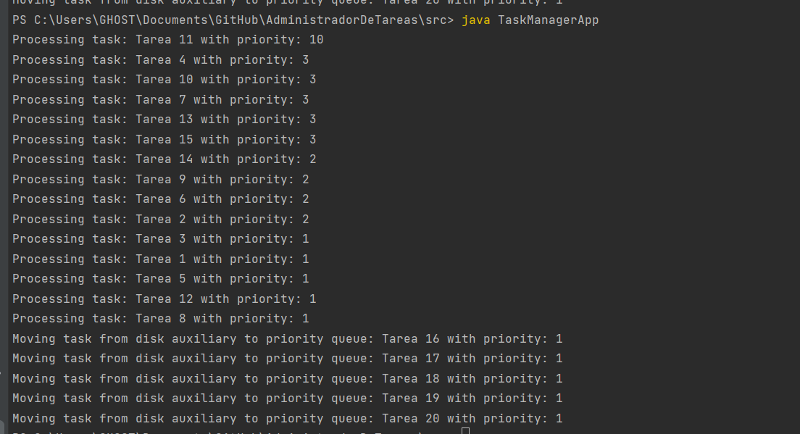
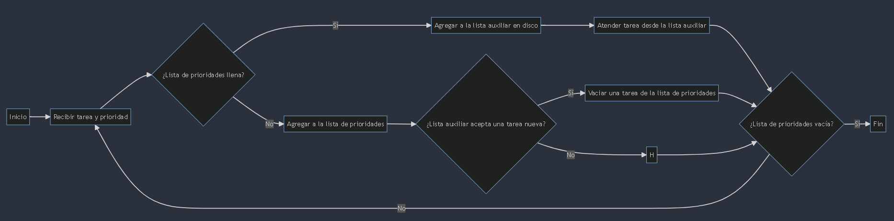
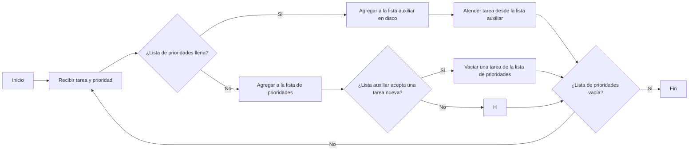

# Task Manager Application

This Java program simulates a task manager for a data server that handles tasks based on their priorities.

## SDK FOR EXECUTION:
corretto 19


## Description

The Task Manager Application demonstrates the handling of tasks with varying priorities using two types of data servers:
1. `PriorityQueueDataServer`: Manages tasks with priorities in a priority queue.
2. `DiskAuxiliaryDataServer`: Handles overflow tasks by storing them in an auxiliary queue on disk.

## How to Run

1. **Compilation**: Open a terminal and navigate to the directory where the `TaskManagerApp.java` file is located:

   ```bash
   cd path/to/directory
2. Compile the Java file using the javac command:
      ```bash
   javac TaskManagerApp.java
   
3. Execution: Still in the terminal and the same directory, run the program using the java command:
      ```bash
    java TaskManagerApp
The program will display the processing of tasks with their priorities.

# example of execution


## diagram



### mermaid code


CARLOS G